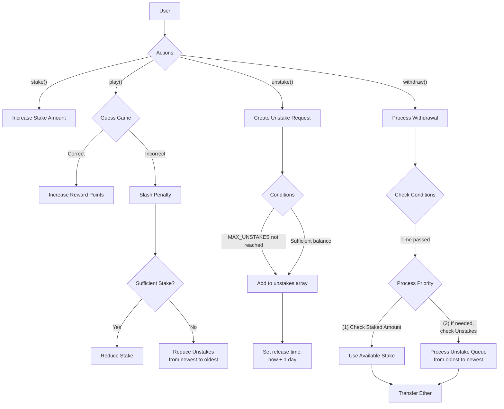

# NIE-BLO. Tutorial 7. Security II

## Stage 1. Number Magic

Write a fuzz test to enter a correct number on the keypad and unlock the hidden variable.

## Stage 2. Faulty Stakes

The contract showcases a staking system where users (stakers) can interact with Ether stakes and perform various operations. There is a mistake in the code. Write a fuzz test for this contract.

> Tip: you don't have to fully understand the code to write a fuzz test and find the hidden bug.

- **Stakers** can stake Ether into the contract. This stake is recorded in a mapping that associates each staker with a `Stake` struct. The `Stake` struct holds the total staked amount, a pointer to the first pending unstake, and an array of `Unstake` requests.
- **Stakers** can participate in a guessing game. They use the `play` function to input a guessed value based on the block timestamp. If the guess is incorrect, a slashing mechanism reduces their stake by a penalty amount. Only stakers with a positive stake can participate in this game.
- **Stakers** can request an unstake to withdraw some or all of their staked Ether. This action creates an `Unstake` request that is stored in their `Stake` struct. Each `Unstake` entry includes the amount to withdraw and a release time, which is set as the current timestamp plus one day. A maximum of 10 active unstake requests is allowed.
- **Active Unstake Requests** are those pending until their release time is reached. When a staker calls `withdraw(amount)`, the contract iterates through their `Unstake` requests, starting from the first pending one, until the requested amount is covered. If a request is depleted, its amount is set to zero and the pointer advances.
- **Slashing Mechanism** transfers the penalty to the contract's reserve. If the staker's reserves are insufficient, the penalty is deducted from `Unstake` requests, starting from the latest. The contract owner can withdraw the accumulated reserve.

